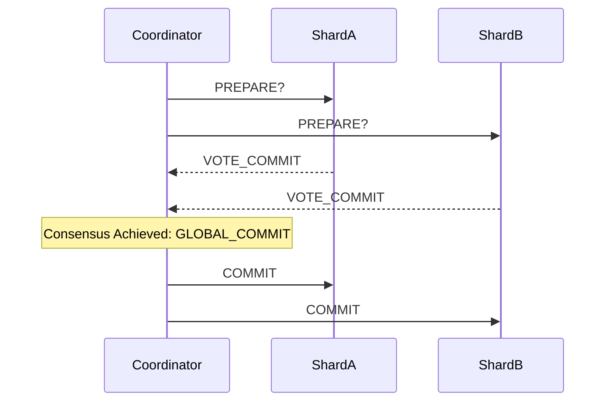

# Two-Phase Commit (2PC) Distributed Coordinator Skill

Robust, zero-dependency Python implementation of the classic **Two-Phase Commit (2PC)** protocol ensuring all-or-nothing atomicity across distributed database shards.

## Features
- **Phase 1 (Prepare)**: Coordinator solicits prepare votes from all participants.
- **Phase 2 (Commit/Abort)**: Unanimous consensus triggers GLOBAL_COMMIT; any veto enforces GLOBAL_ABORT.
- **Zero External Dependencies**: Pure Python standard library.
- **Native MCP Protocol**: JSON-RPC 2.0 stdio server compatible with Claude Desktop, Cursor, and Windsurf.

## Architecture

